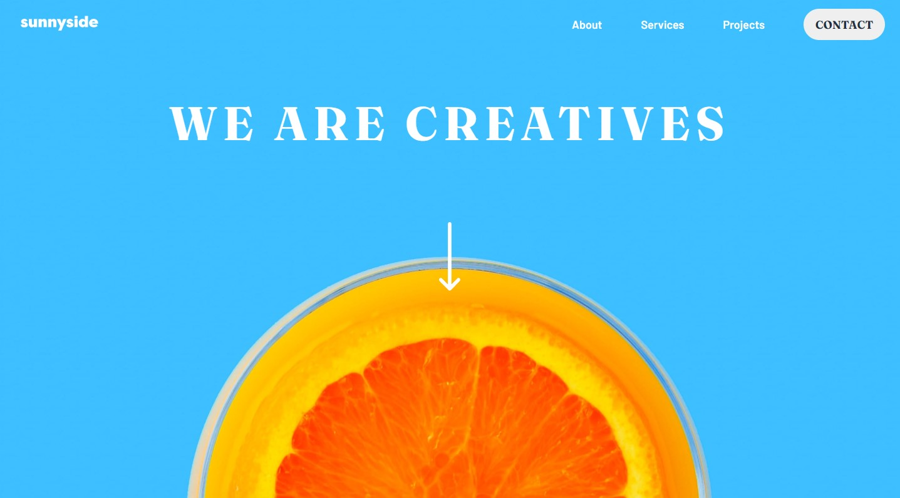

# Frontend Mentor - Sunnyside agency landing page

This is a solution to the [Interactive card details form challenge on Frontend Mentor](https://www.frontendmentor.io/challenges/sunnyside-agency-landing-page-7yVs3B6ef). Frontend Mentor challenges help you improve your coding skills by building realistic projects. 

## Overview

### The challenge

Users should be able to:

- View the optimal layout for the site depending on their device's screen size
- See hover states for all interactive elements on the page

### Screenshot

### Links

- Solution URL: (https://www.frontendmentor.io/challenges/sunnyside-agency-landing-page-7yVs3B6ef/hub/sunnysideagencylandingpageusinghtml5cssflexboxgridjsvanilla-jfDQSKqblv)
- Live Site URL: (https://agustin180.github.io/Sunnyside-agency-landing-page-using-HTML5-CSS-Flexbox-Grid-and-JS-Vanilla/)

## My process

### Built with

- HTML5
- CSS
- Flexbox
- Grid
- JS Vanilla

## Author

- Website - [Agustin Cortazzi](https://agustin180.github.io/Portfolio/)
- Frontend Mentor - [@Agustin180](https://www.frontendmentor.io/profile/Agustin180)
- Linkedin - [Agustin Cortazzi](https://www.linkedin.com/in/agustin-cortazzi-913196211/)
